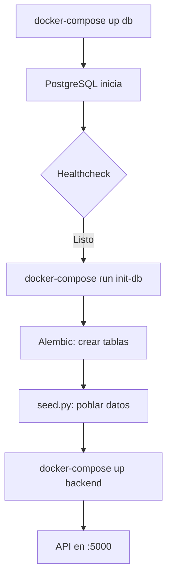

# Backend - Sistema de Gestión de Locales

Sistema backend basado en Flask + SQLAlchemy + PostgreSQL para gestión de locales, pedidos y reservas.

## Tabla de Contenidos

- [Requisitos](#requisitos)
- [Estructura del Proyecto](#estructura-del-proyecto)
- [Configuración](#configuración)
- [Uso con Docker](#uso-con-docker)
- [Migraciones de Base de Datos](#migraciones-de-base-de-datos)
- [API Endpoints](#api-endpoints)

## Requisitos

- Docker Desktop
- Docker Compose

**No se requiere instalación local de Python ni PostgreSQL** - todo se ejecuta en contenedores Docker.

## Configuración

### 1. Variables de Entorno

Copia el archivo `.env.example` a `.env`:

```bash
cp .env.example .env
```

Edita `.env` con tus credenciales:

```env
# Base de Datos
DB_USER=tu_usuario
DB_PASSWORD=tu_contraseña
DB_HOST=localhost       # 'db' en Docker
DB_PORT=5432
DB_NAME=tu_bd

# PostgreSQL (Docker)
POSTGRES_USER=tu_usuario
POSTGRES_PASSWORD=tu_contraseña
POSTGRES_DB=tu_bd
```

## Uso con Docker

### Primera Vez - Paso a Paso

#### Paso 1: Configurar Variables de Entorno

Asegúrate de tener tu archivo `.env` configurado (ver sección [Configuración](#configuración)).

#### Paso 2: Construir Imágenes Docker

```bash
# Construir las imágenes de Docker (primera vez)
docker-compose build
```

**Qué hace:** Crea la imagen de Python con todas las dependencias del `requirements.txt`.

#### Paso 3: Levantar PostgreSQL

```bash
# Iniciar solo la base de datos en segundo plano
docker-compose up db -d
```

**Qué hace:** Levanta PostgreSQL en el puerto 5432.

#### Paso 4: Verificar que PostgreSQL esté listo

```bash
# Ver el estado de los contenedores
docker-compose ps
```

**Resultado esperado:**

```
NAME                  STATUS
backend-db-1          Up (healthy)
```

Espera hasta que veas `(healthy)` - esto significa que el healthcheck pasó.

#### Paso 5: Inicializar la Base de Datos

```bash
# Crear tablas con Alembic y poblar datos iniciales
docker-compose --profile init run --rm init-db
```

**Qué hace:**

1. Genera migración inicial de Alembic
2. Crea todas las tablas en PostgreSQL
3. Ejecuta `seed.py` para insertar datos de referencia (roles, comunas, etc.)
4. Inserta 5 locales de ejemplo

**Salida esperada:**

```
Iniciando configuración de base de datos...
Generando migración inicial...
Aplicando migraciones de base de datos...
Poblando datos iniciales...
  → Insertando Roles...
    ✓ Roles insertados
  → Insertando Tipos de Local...
    ✓ Tipos de Local insertados
  ...
Base de datos poblada exitosamente!
Base de datos inicializada correctamente!
```

#### Paso 6: Levantar el Backend

```bash
# Iniciar el servidor Flask
docker-compose up backend
```

**Qué hace:** Inicia la API REST de Flask en `http://localhost:5000`.

**Salida esperada:**

```
backend-backend-1  |  * Running on http://0.0.0.0:5000
backend-backend-1  |  * Debug mode: on
```

#### Paso 7: Verificar que Todo Funcione

En otra terminal o navegador:

```bash
# Health check
curl http://localhost:5000/

# Ver locales
curl http://localhost:5000/locales/
```

**Resultado esperado:**

- Health check: `{"status":"ok","message":"Backend Flask funcionando correctamente"}`
- Locales: Array JSON con 5 locales

---

### Resumen de Comandos (Primera Vez)

```bash
# Ejecutar todo de una vez (después de configurar .env)
docker-compose build
docker-compose up db -d
# Esperar ~5 segundos
docker-compose --profile init run --rm init-db
docker-compose up backend
```

---

### Uso Diario

Una vez que ya inicializaste todo, solo necesitas:

```bash
# Levantar todo (db + backend)
docker-compose up

# O en segundo plano
docker-compose up -d

# Ver logs en tiempo real
docker-compose logs -f backend

# Detener todo
docker-compose down
```

---

### Reset Completo (Borrar todos los datos)

Si quieres empezar de cero:

```bash
# CUIDADO: Esto borra TODOS los datos de la base de datos
docker-compose down -v

# Re-inicializar desde cero
docker-compose up db -d
docker-compose --profile init run --rm init-db
docker-compose up backend
```

---

### Explicación de Servicios

El `docker-compose.yml` tiene 4 servicios, pero solo 2 corren por defecto:

| Servicio  | ¿Se levanta automáticamente? | Propósito                         |
| --------- | ---------------------------- | --------------------------------- |
| `db`      | SÍ                           | PostgreSQL (siempre activo)       |
| `backend` | SÍ                           | API Flask (siempre activo)        |
| `app`     | NO (profile: tools)          | Comandos manuales de Alembic      |
| `init-db` | NO (profile: init)           | Inicializar BD (solo primera vez) |

Los servicios con `profiles` solo se ejecutan cuando los invocas explícitamente.

## Migraciones de Base de Datos

Este proyecto usa **Alembic** para gestionar el schema de la base de datos.

### Crear una Migración

Cuando modifiques modelos en `src/models/models.py`:

```bash
# Generar migración automáticamente
docker-compose run --rm app alembic revision --autogenerate -m "Descripción del cambio"

# Aplicar migración
docker-compose run --rm app alembic upgrade head
```

### Ver Estado de Migraciones

```bash
# Ver historial
docker-compose run --rm app alembic history

# Ver migración actual
docker-compose run --rm app alembic current
```

### Revertir Migración

```bash
# Revertir última migración
docker-compose run --rm app alembic downgrade -1

# Revertir a versión específica
docker-compose run --rm app alembic downgrade <revision_id>
```

## Datos Iniciales (Seed)

El archivo `src/db/seed.py` puebla la base de datos con:

- **Datos de Referencia**: Roles, Tipos de Local, Comunas, Tipos de Redes, Tipos de Fotos, Categorías
- **Datos de Ejemplo**: 5 Direcciones y 5 Locales de prueba

### Ejecutar Seed Manualmente

```bash
# Dentro de Docker
docker-compose run --rm app python src/db/seed.py
```

El seed es **idempotente**: solo inserta datos que no existen.

## API Endpoints

### Health Check

```bash
GET /
```

Respuesta:

```json
{
  "status": "ok",
  "message": "Backend Flask funcionando correctamente"
}
```

### Locales

```bash
GET /locales
```

Retorna todos los locales.

Respuesta:

```json
[
  {
    "id": 1,
    "nombre": "El Gran Sabor",
    "telefono": 123456789,
    "correo": "contacto@gransabor.cl",
    "id_direccion": 1,
    "id_tipo_local": 1
  },
  ...
]
```

## Tecnologías

- **Flask** 3.0.3 - Framework web
- **SQLAlchemy** 2.0.29 - ORM
- **Alembic** 1.17.2 - Migraciones de BD
- **Pydantic** 2.12.4 - Validación de datos
- **PostgreSQL** 18 - Base de datos
- **Docker** - Contenedores

## Flujo de Inicialización



## Notas

- **Alembic** gestiona el schema (tablas, columnas, índices)
- **Pydantic** valida datos de entrada/salida del API
- Todos los comandos usan Docker, no requiere instalación local
- Los datos se persisten en el volumen `pgdata` de Docker
- El backend se recarga automáticamente con cambios (hot-reload)

## Problemas Comunes

### Puerto 5432 en uso

Si PostgreSQL ya está corriendo en tu máquina:

```bash
# Detener PostgreSQL local (Windows)
Stop-Service postgresql

# O cambiar puerto en docker-compose.yml
ports:
  - "5433:5432"  # Usar puerto 5433 en host
```

### Permisos en scripts/init_db.sh

```bash
# Dar permisos de ejecución (Linux/Mac)
chmod +x scripts/init_db.sh
```

### Errores de importación

Asegúrate que `PYTHONPATH=/app/src` esté configurado en `docker-compose.yml`.

## Contacto

Para dudas o sugerencias, contacta al equipo de desarrollo.
